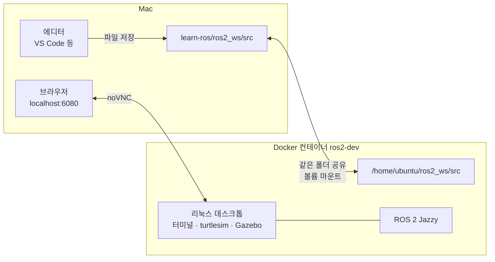
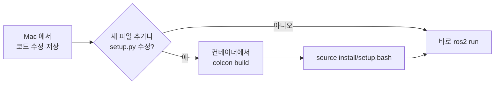
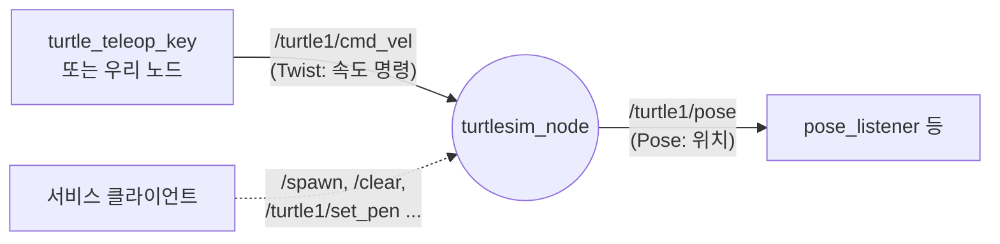

# ROS 2 입문 가이드 — 지금까지 한 것 한눈에 보기

> 이 문서는 **ROS 2 를 처음 접하는 사람**이 이 저장소를 받아서, 환경을 띄우고, turtlesim 실습을 하고,
> 다음 단계(Gazebo 미로)로 넘어갈 준비까지 따라올 수 있도록 지금까지의 작업을 정리한 것이다.
> 세부 실습은 각 단계 문서로 연결된다.

## 목차

1. [이 프로젝트는 무엇인가](#1-이-프로젝트는-무엇인가)
2. [먼저 알아야 할 용어 10개](#2-먼저-알아야-할-용어-10개)
3. [환경 준비 — 처음 한 번](#3-환경-준비--처음-한-번)
4. [매일 쓰는 작업 흐름](#4-매일-쓰는-작업-흐름)
5. [폴더 구조](#5-폴더-구조)
6. [1차수: turtlesim 기초 (완료)](#6-1차수-turtlesim-기초-완료)
7. [2차수 준비: Gazebo 미로 환경 (검증 완료)](#7-2차수-준비-gazebo-미로-환경-검증-완료)
8. [문제 해결 모음](#8-문제-해결-모음)
9. [명령어 치트시트](#9-명령어-치트시트)

---

## 1. 이 프로젝트는 무엇인가

**Mac 에 ROS 2 를 직접 설치하지 않고**, Docker 컨테이너 안에 ROS 2 Jazzy 와 리눅스 데스크톱을 띄워서 학습하는 환경이다.
데스크톱 화면은 브라우저로 본다.



핵심 아이디어는 세 가지다.

- **코드는 Mac 에서 쓴다.** `ros2_ws/src/` 폴더는 컨테이너와 공유되므로 저장하면 컨테이너에도 바로 보인다.
- **실행과 빌드는 컨테이너에서 한다.** ROS 2 는 컨테이너 안에만 설치되어 있다.
- **화면이 필요한 프로그램**(turtlesim, Gazebo, rqt)은 브라우저의 noVNC 데스크톱에서 본다.

### 학습 로드맵

| 차수 | 내용 | 상태 |
|---|---|---|
| 0 | Docker + noVNC 개발 환경 구성 | ✅ 완료 |
| 1 | turtlesim 으로 CLI · Topic · Service 기초 | ✅ 완료 |
| 2 | Gazebo + TurtleBot3 로 장애물 · 미로 환경 | 🔜 환경 검증 완료, 구성 예정 |
| 이후 | SLAM(지도 작성), Nav2(자율 주행), Action, Launch 등 | 예정 |

---

## 2. 먼저 알아야 할 용어 10개

처음에는 이 정도만 알면 충분하다. 나머지는 실습하면서 자연스럽게 익힌다.

| 용어 | 한 줄 설명 | turtlesim 예 |
|---|---|---|
| **Node** (노드) | 한 가지 일을 하는 실행 프로그램 | `turtlesim_node`(시뮬레이터), `turtle_teleop_key`(키보드 조종) |
| **Topic** (토픽) | 노드끼리 데이터를 **계속 흘려보내는** 통로. 보내는 쪽과 받는 쪽이 서로를 몰라도 된다 | `/turtle1/cmd_vel`(속도 명령), `/turtle1/pose`(위치) |
| **Publisher / Subscriber** | 토픽에 데이터를 **보내는** 쪽 / **받는** 쪽 | 조종기 → cmd_vel 발행, 시뮬레이터 → cmd_vel 구독 |
| **Message** (메시지) | 토픽으로 오가는 데이터의 **형식** | `geometry_msgs/msg/Twist` = 직선 속도 + 회전 속도 |
| **Service** (서비스) | **한 번 요청하면 한 번 응답**하는 통신 | `/spawn` → 거북이 생성, `/clear` → 화면 지우기 |
| **Parameter** (파라미터) | 노드 실행 시 바꿀 수 있는 설정값 | `draw_circle` 의 속도 `linear`, `angular` |
| **Package** (패키지) | 노드들을 묶은 배포 단위 | `turtlesim`, 우리가 만든 `turtlesim_basics` |
| **Workspace** (워크스페이스) | 내 패키지들을 모아 빌드하는 폴더 | `~/ros2_ws` |
| **colcon** | 워크스페이스를 빌드하는 도구 | `colcon build --symlink-install` |
| **ROS_DOMAIN_ID** | 같은 번호끼리만 통신하는 “채널 번호” | 이 환경은 `7` |

> **Topic vs Service 를 한 문장으로**
> 계속 흐르는 데이터(센서 값, 속도 명령)는 **Topic**, 한 번 시키고 결과를 받는 일(생성, 설정 변경, 조회)은 **Service**.

---

## 3. 환경 준비 — 처음 한 번

### 3-1. 필요한 것

- Docker Desktop (Mac)
- 브라우저

### 3-2. Docker Desktop 자원 늘리기

Gazebo 같은 3D 시뮬레이터는 CPU 와 메모리를 많이 쓴다. **Docker Desktop → Settings → Resources** 에서 아래 값 이상으로 맞춘다.

| 항목 | 권장 | 이유 |
|---|---|---|
| CPUs | **6** | Gazebo 는 GPU 없이 CPU 로 화면을 그려서 CPU 를 많이 쓴다 (측정해 보니 약 2~3코어) |
| Memory | **12 GB** | 시뮬레이터, SLAM, Nav2 를 동시에 띄울 여유 |

설정을 바꾸면 Docker Desktop 이 재시작되고, 실행 중이던 **모든 컨테이너가 잠시 멈췄다가** 다시 올라온다.

### 3-3. 컨테이너 띄우기

```bash
# Mac 터미널, 저장소 폴더에서
docker compose up -d --build     # 처음에는 이미지 빌드로 10~20분 걸린다
docker compose ps                # STATUS 가 Up 이면 성공
```

이미지에는 이미 아래 도구가 설치되어 있다 (`Dockerfile` 참고).

| 도구 | 용도 | 사용 차수 |
|---|---|---|
| turtlesim, rqt | 2D 거북이 시뮬레이터, GUI 도구 | 1차수 |
| Gazebo Sim, ros_gz | 3D 물리 시뮬레이터와 ROS 연결 | 2차수 |
| TurtleBot3 | LiDAR 를 단 교육용 로봇 모델과 월드 | 2차수 |
| Nav2, slam_toolbox, cartographer | 자율 주행, 지도 작성 | 이후 |

### 3-4. 데스크톱 접속

1. 브라우저에서 **http://localhost:6080** 접속
2. 비밀번호를 물으면 **`ubuntu`** 를 입력한다 (리눅스 계정 `ubuntu` / 비밀번호 `ubuntu`, `sudo` 는 비밀번호 없이 된다)
3. 데스크톱에서 터미널을 연다

### 3-5. 처음 한 번 빌드

데스크톱 터미널에서:

```bash
cd ~/ros2_ws
colcon build --symlink-install
source install/setup.bash
ros2 pkg executables turtlesim_basics    # 실행 파일 6개가 보이면 성공
```

---

## 4. 매일 쓰는 작업 흐름



- `--symlink-install` 로 빌드했기 때문에 **기존 `.py` 파일만 고쳤다면 다시 빌드하지 않아도 된다.**
- 새 터미널은 ROS 환경을 자동으로 읽는다 (`~/.bashrc` 설정). 빌드 **직후에 이미 열려 있던** 터미널에서는 `source ~/ros2_ws/install/setup.bash` 를 한 번 실행한다.

### 컨테이너 터미널에 들어가는 두 가지 방법

| 방법 | 명령 | 언제 쓰나 |
|---|---|---|
| noVNC 데스크톱 | 브라우저 → 터미널 열기 | 화면이 필요한 작업 (turtlesim, Gazebo) |
| Mac 터미널에서 접속 | `docker exec -it -u ubuntu ros2-dev bash` | 화면 없이 명령만 칠 때 |

> ⚠ `-u ubuntu` 를 빼면 **root** 로 들어간다. 그러면 `~/ros2_ws` 가 보이지 않고, 빌드한 파일이 root 소유가 되어 나중에 권한 문제가 생긴다.

### 컨테이너 관리

```bash
docker compose ps                 # 상태 확인
docker compose restart            # 재시작 (터미널에서 실행 중이던 프로그램은 종료된다)
docker compose up -d              # docker-compose.yml 을 바꿨을 때 → 컨테이너를 새로 만든다
docker compose up -d --build      # Dockerfile 을 바꿨을 때 → 이미지를 다시 빌드한다
```

**코드만 바꿨을 때는 컨테이너를 재시작할 필요가 없다.** 폴더를 공유하고 있기 때문이다.

---

## 5. 폴더 구조

```text
learn-ros/
├── Dockerfile               # ROS 2 Jazzy + 데스크톱 + 실습 도구 이미지
├── docker-compose.yml       # 포트(6080), 폴더 공유, ROS_DOMAIN_ID=7
├── README.md                # 빠른 시작
├── docs/learn/
│   ├── getting-started.md   # ← 지금 이 문서
│   └── turtlesim/           # 1차수 단계별 가이드
│       ├── README.md
│       ├── 01-cli.md
│       ├── 02-topic.md
│       └── 03-service.md
└── ros2_ws/                 # 컨테이너의 ~/ros2_ws 와 같은 폴더
    ├── src/
    │   └── turtlesim_basics/          # 1차수 실습 패키지 (Python)
    │       ├── package.xml            # 패키지 정보, 의존성
    │       ├── setup.py               # 실행 파일 이름 등록 (entry_points)
    │       └── turtlesim_basics/*.py  # 노드 코드 6개
    └── build/ install/ log/  # colcon 이 만드는 폴더 (git 제외)
```

---

## 6. 1차수: turtlesim 기초 (완료)

turtlesim 은 화면 속 거북이를 움직이는 **2D 시뮬레이터**다. 단순하지만 실제 로봇과 똑같은 방식(토픽으로 속도를 보내고, 토픽으로 위치를 받는다)으로 동작해서 입문용으로 쓰인다.



### 단계별 구성

| 단계 | 문서 | 무엇을 배우나 | 실습 |
|---|---|---|---|
| 1 | [01-cli.md](turtlesim/01-cli.md) | 코드 없이 `ros2` 명령어로 노드·토픽·서비스를 탐색하고 직접 명령을 보낸다 | `ros2 topic pub`, `ros2 service call` 예제 모음 |
| 2 | [02-topic.md](turtlesim/02-topic.md) | Python 으로 Publisher / Subscriber 를 만든다 | `pose_listener`, `draw_circle`, `wall_bounce` |
| 3 | [03-service.md](turtlesim/03-service.md) | Python 으로 Service Client / Server 를 만든다 | `spawn_turtle`, `draw_square`, `pose_reporter` |

### 만든 노드 6개

| 노드 | 종류 | 하는 일 | 실행 |
|---|---|---|---|
| `pose_listener` | Subscriber | 거북이 위치를 1초마다 출력 | `ros2 run turtlesim_basics pose_listener` |
| `draw_circle` | Publisher | 원을 그리며 이동 (속도는 파라미터) | `ros2 run turtlesim_basics draw_circle --ros-args -p angular:=2.0` |
| `wall_bounce` | Pub + Sub | 위치를 보고 벽 근처에서 방향을 튼다 | `ros2 run turtlesim_basics wall_bounce` |
| `spawn_turtle` | Service Client | 새 거북이 생성 | `ros2 run turtlesim_basics spawn_turtle --ros-args -p name:=turtle2` |
| `draw_square` | Service Client | 서비스를 순서대로 호출해 사각형을 그린다 | `ros2 run turtlesim_basics draw_square` |
| `pose_reporter` | Service Server | 요청하면 현재 위치를 응답 | `ros2 run turtlesim_basics pose_reporter` |

### 10분 맛보기

터미널 세 개를 연다.

```bash
# 터미널 1 — 시뮬레이터
ros2 run turtlesim turtlesim_node

# 터미널 2 — 위치 보기
ros2 run turtlesim_basics pose_listener

# 터미널 3 — 명령 보내기
ros2 topic pub -1 /turtle1/cmd_vel geometry_msgs/msg/Twist "{linear: {x: 2.0}}"   # 2칸 앞으로
ros2 service call /spawn turtlesim/srv/Spawn "{x: 2.0, y: 2.0, name: 'turtle2'}"   # 거북이 추가
ros2 run turtlesim_basics draw_square                                             # 사각형 그리기
```

터미널 2 의 x 값이 바뀌고, 화면에 거북이와 빨간 사각형이 보이면 성공이다.

### 실습하며 알게 된 turtlesim 의 특징

| 특징 | 설명 |
|---|---|
| **1초 규칙** | 마지막 속도 명령을 받은 뒤 **1초 동안만** 움직이고 멈춘다. 그래서 계속 움직이려면 명령을 주기적으로 보내야 한다 |
| 속도 × 1초 = 이동량 | `ros2 topic pub -1` 로 `x: 2.0` 을 한 번 보내면 약 2칸 이동한다. `angular.z: 1.5708`(π/2) 이면 90° 회전 |
| 옆으로는 기본적으로 못 간다 | `linear.y` 는 무시된다. `--ros-args -p holonomic:=true` 로 띄워야 옆으로 움직인다 |
| 이름 중복 spawn | 오류 대신 **빈 이름**을 돌려준다. 응답 값을 직접 확인해야 한다 |
| 화면 좌표 | 대략 0 ~ 11. 시작 위치는 (5.54, 5.54) |

---

## 7. 2차수 준비: Gazebo 미로 환경 (검증 완료)

turtlesim 에는 **장애물이 없고**, 거북이는 자기 좌표만 알 수 있다.
실제 로봇처럼 벽과 장애물을 **센서로 감지하며** 움직이려면 3D 물리 시뮬레이터 **Gazebo** 와 교육용 로봇 **TurtleBot3** 를 쓴다.
필요한 패키지는 이미 이미지에 들어 있으므로 **추가 설치 없이** 바로 쓸 수 있다.

### turtlesim 과 무엇이 다른가

| | turtlesim | Gazebo + TurtleBot3 |
|---|---|---|
| 세계 | 2D, 장애물 없음 | 3D, 벽·기둥 등 실제로 부딪히는 물체 |
| 속도 명령 토픽 | `/turtle1/cmd_vel` | `/cmd_vel` |
| 속도 메시지 타입 | `geometry_msgs/msg/Twist` | **`geometry_msgs/msg/TwistStamped`** (주의!) |
| 로봇이 아는 것 | 자기 좌표(`/turtle1/pose`) | LiDAR 거리값 360개(`/scan`), 주행 기록(`/odom`) |
| 단위 | 칸 | 미터(m) |

> **TwistStamped 는 Twist 에 시간 정보(header)를 붙인 것**이다. 속도 값은 `twist:` 한 단계 안에 들어간다.
>
> ```bash
> # turtlesim
> ros2 topic pub -r 10 /turtle1/cmd_vel geometry_msgs/msg/Twist "{linear: {x: 2.0}}"
> # TurtleBot3 (Gazebo)
> ros2 topic pub -r 10 /cmd_vel geometry_msgs/msg/TwistStamped "{twist: {linear: {x: 0.2}}}"
> ```

### 이 환경에서 실제로 돌려 본 결과

`turtlebot3_world`(육각형 벽 안에 기둥 장애물이 있는 월드)를 띄워 측정했다.

| 항목 | 결과 | 의미 |
|---|---|---|
| 기동 시간 | 약 4초 | 빠르다 |
| 실시간 배율 (RTF) | 약 1.0 | 시뮬레이션 시간이 현실 시간과 같은 속도로 흐른다 (1.0 미만이면 느려짐) |
| LiDAR `/scan` | 초당 약 4.5회, 360방향 거리값 | 가장 가까운 장애물까지 0.20m 감지 |
| 주행 `/odom` | 초당 약 43회 | 0.2m/s 로 4초 명령 → 0.66m 이동 |
| CPU | 시뮬레이터 약 0.5코어, 화면 표시 약 2코어 | 6코어 중 절반 정도 사용 |

### 직접 띄워 보기

```bash
# 터미널 1 — Gazebo 와 로봇 실행 (화면에 3D 월드가 뜬다)
ros2 launch turtlebot3_gazebo turtlebot3_world.launch.py

# 터미널 2 — 토픽 확인
ros2 topic list                       # /cmd_vel /scan /odom /tf ... 가 보인다
ros2 topic hz /scan                   # LiDAR 주기

# 터미널 3 — 앞으로 조금 이동 (Ctrl+C 로 정지)
ros2 topic pub -r 10 /cmd_vel geometry_msgs/msg/TwistStamped "{twist: {linear: {x: 0.2}}}"
```

> 종료는 터미널 1 에서 **Ctrl+C**.
> 로봇 모델은 `~/.bashrc` 의 `TURTLEBOT3_MODEL=burger` 로 이미 지정되어 있다.

### 2차수 계획 (예정 — 상세는 [roadmap.md](roadmap.md))

| 단계 | 내용 | turtlesim 에서 이어지는 개념 |
|---|---|---|
| 1 | Gazebo 에서 CLI 로 로봇을 움직이고 `/scan` 관찰 | 1차수 Step 1 (CLI) |
| 2 | LiDAR 로 장애물을 피하는 노드 | `wall_bounce` 의 입력을 pose → scan 으로 바꾼 것 |
| 3 | 직접 설계한 미로 월드에서 벽 따라가기로 탈출 | 구독 → 판단 → 발행 제어 루프 |
| 4 | SLAM 으로 미로 지도 만들기 | (새 개념) |
| 5 | Nav2 로 목표 지점까지 자율 주행 | (새 개념) |

---

## 8. 문제 해결 모음

실습 중 실제로 겪었거나 겪기 쉬운 문제들이다.

| 증상 | 원인 | 해결 |
|---|---|---|
| `error: the following arguments are required: message_type` | 명령에 쓴 `$C`, `$T` 같은 셸 변수가 **이 터미널에서** 설정되지 않았다 | 변수를 다시 설정하거나, 토픽 이름과 타입을 직접 쓴다 |
| 모든 명령 앞에 `ROS_LOCALHOST_ONLY is deprecated` 경고 | compose 에 예전 방식의 환경변수를 쓰고 있다 | 동작에는 문제 없으니 무시한다 |
| `ros2 run` 에서 패키지를 못 찾는다 | 빌드 후 `source` 를 하지 않았다 | `source ~/ros2_ws/install/setup.bash` |
| 새 노드 파일을 추가했는데 실행이 안 된다 | `setup.py` 의 `entry_points` 에 등록하지 않았거나 다시 빌드하지 않았다 | 등록 후 `colcon build --symlink-install` |
| 명령을 보내도 거북이가 반응하지 않는다 | turtlesim 이 꺼져 있거나 터미널마다 `ROS_DOMAIN_ID` 가 다르다 | `ros2 node list` 로 `/turtlesim` 이 보이는지, `echo $ROS_DOMAIN_ID` 가 7 인지 확인 |
| 거북이가 떨리거나 이상하게 움직인다 | 발행자 두 개(예: teleop 과 draw_circle)가 동시에 명령을 보내고 있다 | `ros2 topic info /turtle1/cmd_vel -v` 로 발행자 수 확인 후 하나를 끈다 |
| `Failed to populate field: ... no attribute 'x:2.0'` | YAML 에서 콜론 뒤에 공백이 없다 | `x: 2.0` 처럼 띄어 쓴다 |
| TurtleBot3 가 `/cmd_vel` 에 반응하지 않는다 | `Twist` 로 보냈다 | `TwistStamped` + `twist:` 로 감싼다 |
| Mac 에디터에서 `import rclpy` 에 빨간 줄 | ROS 가 Mac 이 아니라 컨테이너에만 설치되어 있다 | 무시해도 된다. 실행은 컨테이너에서 한다 |
| `docker exec` 로 들어갔더니 `~/ros2_ws` 가 없다 | root 로 들어갔다 | `docker exec -it -u ubuntu ros2-dev bash` |
| Gazebo 가 느리다 | Docker 자원이 부족하다 | 3-2절처럼 CPU 6 / 메모리 12GB 이상으로 올린다 |
| 같은 이름의 시뮬레이터가 두 개 떠서 결과가 뒤섞인다 | 이전에 띄운 프로세스가 남아 있다 | 해당 터미널에서 Ctrl+C. 확인은 `ros2 node list` |

---

## 9. 명령어 치트시트

### 탐색

```bash
ros2 node list                          # 실행 중인 노드
ros2 node info /turtlesim               # 노드가 쓰는 토픽·서비스
ros2 topic list -t                      # 토픽 + 타입
ros2 topic echo /turtle1/pose           # 토픽 내용 보기
ros2 topic echo /turtle1/pose --field x # 특정 필드만
ros2 topic hz /turtle1/pose             # 발행 주기
ros2 topic info /turtle1/cmd_vel -v     # 발행자·구독자
ros2 service list -t                    # 서비스 + 타입
ros2 interface show turtlesim/srv/Spawn # 메시지·서비스 구조
rqt_graph                               # 연결 관계를 그림으로
```

### 발행 · 호출

```bash
ros2 topic pub -1    <토픽> <타입> "<값>"     # 한 번
ros2 topic pub -t 3  <토픽> <타입> "<값>"     # 3번
ros2 topic pub -r 10 <토픽> <타입> "<값>"     # 초당 10번 계속 (Ctrl+C 로 중지)
ros2 service call <서비스> <타입> "<값>"
```

### 실행 · 파라미터

```bash
ros2 run <패키지> <실행파일>
ros2 run <패키지> <실행파일> --ros-args -p 이름:=값          # 파라미터 지정
ros2 run <패키지> <실행파일> --ros-args -r 원래토픽:=새토픽   # 토픽 이름 바꾸기(리매핑)
ros2 param list /draw_circle
ros2 param set /draw_circle angular -1.0
ros2 launch <패키지> <launch 파일>
```

### 빌드

```bash
cd ~/ros2_ws
colcon build --symlink-install                        # 전체 빌드
colcon build --symlink-install --packages-select turtlesim_basics   # 한 패키지만
source install/setup.bash
```

---

## 참고 자료

- [ROS 2 Jazzy 공식 문서](https://docs.ros.org/en/jazzy/)
- [Topics / Services / Actions 개념](https://docs.ros.org/en/jazzy/Concepts/Basic/Interfaces-Topics-Services-Actions.html)
- [turtlesim 공식 튜토리얼](https://docs.ros.org/en/jazzy/Tutorials/Beginner-CLI-Tools/Introducing-Turtlesim/Introducing-Turtlesim.html)
- [TurtleBot3 e-Manual (Jazzy)](https://emanual.robotis.com/docs/en/platform/turtlebot3/quick-start/)
